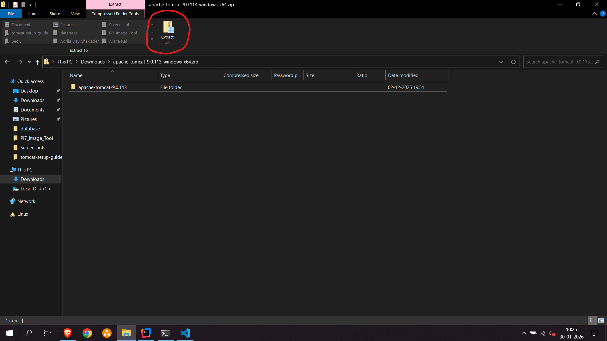
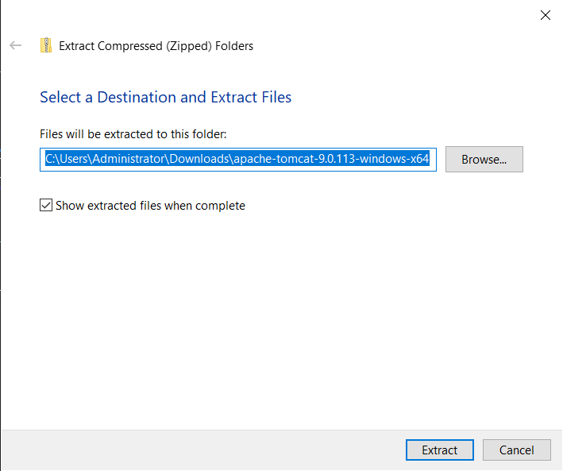

# Setting up a Java EE execution environment with Tomcat 9

Setting up the environment mainly includes configuration of two components:
- Apache Tomcat
- IntelliJ IDE

[!WARNING]
**Important:** An internet connection is required at all times during the setup of the project.

## Installing Tomcat 9
- Download Apache Tomcat 9.0.115 using [this link.](https://dlcdn.apache.org/tomcat/tomcat-9/v9.0.115/bin/apache-tomcat-9.0.115-windows-x64.zip)
- Once it is downloaded make sure to extract it to a proper directory and remember you know the extracted path.
- You can Extract the zip file by double clicking on the zip file and then pressing the `Extract All` button above.
 
- Upon pressing extract all you will be show the following window allowing you to select where should the zip file be extracted to.

- You may change the extraction location to your choice. [!WARNING]
**Important:** Make sure you note the extraction path (Highlited in blue) for later purposes of defining the installation location.
- After Extracting, your Tomcat installation is complete.
